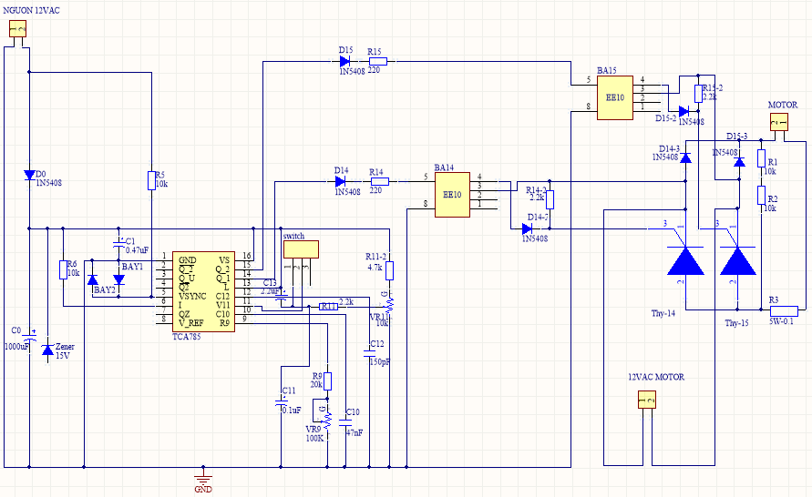

# 🔧 DC Motor Speed Controller using SCR and TCA785

## 📝 Project Summary

This project demonstrates the **design, simulation and building** of a DC motor speed controller using a **silicon-controlled rectifier (SCR)** and the **TCA785 integrated circuit**. The system enables precise speed control through **pulse width modulation (PWM)** and supports both **manual adjustment** and **automatic regulation using a PI feedback controller**.

All circuits are simulated using **Altium Designer**, providing practical verification of design functionality and system behavior.

Successfully implemented the motor speed controller on a physical prototype, confirming simulation results with real-world performance and consistent, precise speed regulation.

---

## 📌 Objectives

- Design a power electronics system to control DC motor speed using SCR-based phase control.
- Use the TCA785 IC to generate PWM signals for thyristor triggering.
- Implement isolation between the control and power stage via a pulse transformer.
- Simulate PI feedback control to maintain stable motor speed.
- Provide hands-on simulation results using Altium.
- Implement a physical prototype
---

## ⚙️ Working Principle

### 💡 DC Motor Characteristics

- The **speed** of a DC motor is directly **proportional to the applied voltage**.
- The **torque** is directly **proportional to the armature current**.
- Direction control is achieved by reversing the polarity of either the **field winding** or **armature**.

### 🧠 Control Concept

   
  

- Motor speed is controlled using **phase-angle control** of the input AC via SCRs.
- The **TCA785** IC performs waveform generation, synchronization, and PWM generation.
- A **manual control unit** adjusts speed via a potentiometer or analog signal.
- A **feedback loop** compares actual motor speed with the reference and adjusts the SCR firing angle accordingly using a **PI controller**.

---

## 🧩 System Architecture

### 1. **Power Supply Block**

- Converts **12V AC, 50Hz** into:
  - **+15V DC** to power the TCA785 control IC.
  - **±15V DC** for operational amplifiers and analog circuits.

### 2. **Control Circuit Block**

  

- Built around the **TCA785 IC**, which performs:
  - Synchronous voltage generation
  - Sawtooth waveform generation
  - Comparator function
  - Pulse output generation for SCR triggering

### 3. **Pulse Transformer Block**

- Provides **galvanic isolation** between the control and power circuits.
- Prevents damage to the controller during short-circuit or high current surges in the load.

### 4. **Power Stage (SCR-based Driver)**

- Uses **thyristors (SCRs)** to modulate the AC power to the DC motor.
- Firing angle is controlled via TCA785 output.

### 5. **Feedback and PI Control Block**

- Feedback voltage is derived from a tachogenerator or voltage sensor proportional to motor speed.
- A **PI controller** (implemented with op-amps) adjusts control signals based on error between setpoint and feedback.

---

## 🔬 Circuit Simulation in Altium Designer

### 🖼️ Motor Speed Control Circuit

   
  

### 🧠 Feedback and PI Controller Circuit

   
  

Each simulation includes:
- Correct voltage supply sizing
- Trigger timing validation
- Motor speed tuning using PWM and feedback

---

## 📁 Repository Structure

dc-motor-controller-scr/  
│  
├── images/ # All schematic and simulation images  
├── docs/ # project report  
├── src/ # Altium Designer files  
├── README.md # Project documentation  

---

## 🛠️ Tools and Technologies

| Tool              | Description                       |
|------------------|-----------------------------------|
| **Altium Designer** | Circuit design and simulation     |
| **TCA785**          | PWM control IC for SCRs           |
| **SCR (Thyristors)**| Power switching and modulation    |
| **Operational Amplifiers** | For signal comparison and PI logic |
| **DC Motor (Simulated)** | Load for control and feedback testing |

---

## 📊 Results & Highlights

- Stable PWM output from TCA785 verified via simulation and physical prototype
- PI controller successfully regulates speed under varying loads
- Galvanic isolation protects control logic in fault conditions
- Modular design enables easy testing of manual vs. automatic control modes

---

## 📌 Applications

- Small industrial DC motor drives
- Educational projects on power electronics and control systems
- Base design for speed-controlled fans, pumps, or conveyors
